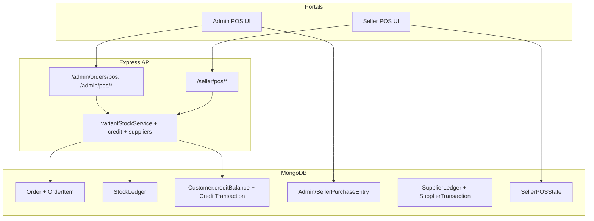
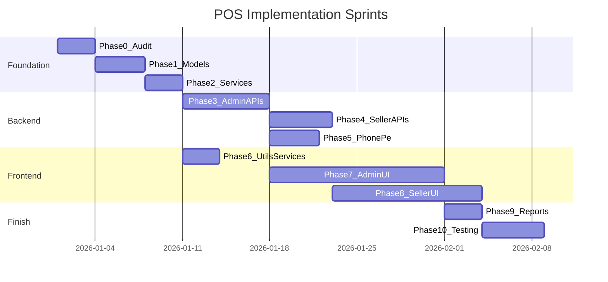

# End-to-End POS System Implementation Plan

## Confirmed Scope

| Decision | Your choice |
|----------|-------------|
| Target stack | React + **JavaScript**, Node/Express + MongoDB |
| Portals | **Admin POS + Seller POS** (full parity) |
| Online payments | **PhonePe** (replaces Razorpay/Cashfree in source) |
| Approach | **Reimplement from scratch** matching geetaecommerce behavior |
| Staff/Cashier module | **Excluded** |
| Target project state | **Existing** with products, orders, customers |

---

## What geetaecommerce POS Actually Is

POS is **not a separate microservice**. It is a billing layer on top of the existing e-commerce domain:

- POS sales are normal `Order` + `OrderItem` documents with string markers (`adminNotes`, `deliveryAddress.address`)
- Inventory changes go through `StockLedger` audit rows + variant stock updates
- Credit sales use `Customer.creditBalance` + `CreditTransaction`
- Purchase/quotation drafts, supplier ledgers, and GST register are **parallel bookkeeping** modules accessed from POS UI
- Receipt/thermal printing is **100% frontend** (`window.print()` + hidden receipt DOM)
- Two near-duplicate monolithic screens drive 80% of UX: [`AdminPOSOrders.tsx`](frontend/src/modules/admin/pages/AdminPOSOrders.tsx) (~6,700 lines) and [`SellerPOSOrders.tsx`](frontend/src/modules/seller/pages/SellerPOSOrders.tsx) (~6,500 lines)



---

## Phase 0 — Audit Target Project (Mandatory First Step)

Before writing POS code, map your **existing** models against geetaecommerce requirements. Do not assume field names match.

### 0.1 Existing model compatibility checklist

**Order model — must support or extend:**
- `customer`, `customerName`, `customerEmail`, `customerPhone`
- `deliveryAddress` object (POS uses `address: "POS Order"`)
- `items[]` ref to OrderItem
- `subtotal`, `tax`, `shipping`, `discount`, `total`
- `paymentMethod` (string: `Cash`, `Credit`, `Online`, etc.)
- `paymentStatus` enum: `Pending | Paid | Failed | Refunded`
- `status` including `Delivered` (POS default)
- `adminNotes` (string — **critical POS discriminator**)
- `orderNumber` auto-generation
- `deliveredAt`, `deliveryBoyStatus`

**OrderItem model — must support:**
- `product`, `productName`, `sku`, `mainImage`
- `quantity`, `unitPrice`, `total`
- `hsnCode`, `gst` (%), `gstAmount`
- `variationId` / `variantId`
- `warrantyType`, `warrantyDuration`
- `status` including `Delivered`

**Product model — must support:**
- `variations[]` with `_id`, `sku`, `stock`, `price`, `discPrice`, `compareAtPrice`, `purchasePrice`, `wholesalePrice`, `barcode[]`, `mainImage`
- Root-level `barcode`, `sku`, `hsnCode`, `gst`
- `status: Active` filter for POS catalog

**Customer model — must add/verify:**
- `creditBalance: Number` (default 0)
- `sellerId: ObjectId | null` — `null` = admin customers; set = seller-scoped customers
- Compound unique indexes: `(phone, sellerId)`, `(email, sellerId)`

**Seller model — must add/verify:**
- `billSettings` embedded object: `shopName`, `address`, `phone`, `notes`, `terms`, `gst`, `fssai` (each with `text` + `enabled`)
- `isEnabled` flag (disabled sellers can still use POS in source — see auth exception below)

**Auth middleware — must support:**
- JWT with `userType: Admin | Seller`
- `checkEnabled` middleware with POS exception: disabled sellers blocked from writes **except** URLs containing `/pos`

### 0.2 Deliverable from Phase 0

Create a short **gap document** in your target repo listing:
- Fields to add to existing schemas
- New collections to create (listed in Phase 1)
- Naming differences (e.g. `productName` vs `name`)
- Whether your existing online orders can coexist with POS markers

---

## Phase 1 — New Database Collections & Schema Extensions

### 1.1 New Mongoose models to create

| Model | Source reference | Purpose |
|-------|------------------|---------|
| `StockLedger` | [`backend/src/models/StockLedger.ts`](backend/src/models/StockLedger.ts) | Inventory audit trail |
| `CreditTransaction` | [`backend/src/models/CreditTransaction.ts`](backend/src/models/CreditTransaction.ts) | Udhaar ledger |
| `SupplierLedger` | [`backend/src/models/SupplierLedger.ts`](backend/src/models/SupplierLedger.ts) | Supplier accounts |
| `SupplierTransaction` | [`backend/src/models/SupplierTransaction.ts`](backend/src/models/SupplierTransaction.ts) | Supplier debt/payments |
| `AdminPurchaseEntry` | [`backend/src/models/AdminPurchaseEntry.ts`](backend/src/models/AdminPurchaseEntry.ts) | Admin purchase/quotation drafts |
| `SellerPurchaseEntry` | [`backend/src/models/SellerPurchaseEntry.ts`](backend/src/models/SellerPurchaseEntry.ts) | Seller purchase/quotation drafts |
| `SellerPOSState` | [`backend/src/models/SellerPOSState.ts`](backend/src/models/SellerPOSState.ts) | Seller multi-bill server sync |
| `GSTReportEntry` | [`backend/src/models/GSTReportEntry.ts`](backend/src/models/GSTReportEntry.ts) | Purchase GST register |
| `SellerOwnedCategory` | [`backend/src/models/SellerOwnedCategory.ts`](backend/src/models/SellerOwnedCategory.ts) | Seller POS-only categories |
| `SellerOwnedSubCategory` | [`backend/src/models/SellerOwnedSubCategory.ts`](backend/src/models/SellerOwnedSubCategory.ts) | Seller POS-only subcategories |

### 1.2 AppSettings extensions

Extend your existing settings model (or create `AppSettings`) with:
- `barcodeSettings`: width, height, fontSize, barcodeHeight, barcodeWidth, showPrice, showName, mrpLabel, spLabel
- `invoiceSettings`: notes, terms, GST text, FSSAI text (enabled + text)

### 1.3 POS order identification convention (replicate exactly)

| Channel | `adminNotes` | `deliveryAddress.address` | Default `status` |
|---------|--------------|---------------------------|------------------|
| Admin POS | `"Created via POS System"` | `"POS Order"` | `Delivered` |
| Admin online POS | `"POS Online Order via PhonePe"` | `"POS Order"` | `Pending` → `Delivered` after verify |
| Seller POS | `"POS Order - Seller: <sellerId>"` | `"POS Order"` | `Delivered` |

**Reporting filters:**
- Admin reports: exclude `adminNotes` matching `/POS Order - Seller:/i`
- Seller reports: include only `adminNotes` matching `/POS Order - Seller: <theirId>/i`

### 1.4 Walk-in customer (runtime, no seed)

When `customerId === "walk-in-customer"`, auto-create/find:
- `email: "walkin@pos.com"`, `phone: "0000000000"`, `name: "Walk-in Customer"`

---

## Phase 2 — Backend Shared Services (JavaScript)

Reimplement these as plain JS modules (source is TypeScript):

### 2.1 Variant helpers + stock service

Port from:
- [`backend/src/modules/product/variantHelpers.js`](backend/src/modules/product/variantHelpers.ts) — `variantsFromProductDoc`, `findVariantById`
- [`backend/src/modules/product/variantStockService.js`](backend/src/modules/product/variantStockService.ts) — `decrementVariantStock`, `incrementVariantStock`, `getVariantStock`

**Rules to replicate:**
- Stock lives on `product.variations[].stock`
- If product has exactly 1 variant and no `variationId` sent, auto-resolve that variant
- Quick-add/custom items (invalid `productId` ObjectId) create order lines **without** stock deduction

### 2.2 GST calculation (inclusive pricing)

POS treats line price as **GST-inclusive** (B2C):

```javascript
const total = unitPrice * quantity;
const gstAmount = total * gstPercent / (100 + gstPercent);
```

Port logic from [`frontend/src/utils/gstUtils.ts`](frontend/src/utils/gstUtils.ts) to backend order creation.

### 2.3 POS product search mapper

Port [`getPOSProducts`](backend/src/modules/admin/controllers/adminProductController.ts) behavior:
- Filter: `status: Active`
- Search across: `productName`, `sku`, `itemCode`, `barcode`, `variations.sku`, `variations.barcode`
- Return variant-aware rows via `productReadMapper.toPOSRow()` pattern

---

## Phase 3 — Admin POS Backend APIs

Wire routes in your admin router mirroring [`backend/src/routes/adminRoutes.ts`](backend/src/routes/adminRoutes.ts) lines 197–245.

### 3.1 Core billing endpoints

| Method | Path | Behavior |
|--------|------|----------|
| `POST` | `/admin/orders/pos` | Create cash/credit POS sale |
| `POST` | `/admin/orders/pos/online` | Create pending order + initiate PhonePe |
| `POST` | `/admin/orders/pos/verify` | Verify PhonePe payment → mark Paid, deduct stock |
| `PATCH` | `/admin/orders/:id/items` | Edit delivered POS bill (stock restore + re-deduct) |
| `POST` | `/admin/pos/exchange` | Return items IN + new items OUT (no new Order) |
| `DELETE` | `/admin/orders/pos/:id` | Delete POS order (walk-in only; **no stock restore**) |
| `GET` | `/admin/products/pos` | POS catalog search |
| `GET` | `/admin/pos/report` | Sales summary + recent orders |
| `GET` | `/admin/orders/pos-report` | Paginated invoice list |
| `GET` | `/admin/pos/stock-ledger` | Filterable ledger |
| `PUT` | `/admin/pos/stock-ledger/:id` | Edit ledger entry (+ optional stock sync) |

**`POST /admin/orders/pos` request body:**
```javascript
{
  customerId: "walk-in-customer" | ObjectId,
  paymentMethod: "Cash" | "Credit" | "Online",
  paymentStatus?: "Paid" | "Pending",
  items: [{
    productId?: string,
    variationId?: string,
    name?: string,
    sku?: string,
    quantity: number,
    price: number,        // or unitPrice
    mrp?: number,
    hsnCode?: string,
    gst?: number,
    warrantyType?: string,
    warrantyDuration?: string
  }]
}
```

**`createPOSOrder` flow (replicate from [`adminOrderController.ts`](backend/src/modules/admin/controllers/adminOrderController.ts) ~L1195):**
1. Validate customer + items + paymentMethod
2. Resolve walk-in customer
3. Create Order shell with POS markers
4. For each line: resolve product/variant, compute inclusive GST, create OrderItem
5. If `paymentMethod === 'Credit'`: set `paymentStatus: Pending`, increment `customer.creditBalance`, create `CreditTransaction type: Order`
6. Update order totals
7. **After save**: decrement variant stock + write `StockLedger { source: "POS", type: "OUT" }`

**`updateOrderItems` flow:**
1. Only for Delivered POS orders
2. Restore old lines → `StockLedger source: ORDER_EDIT_RESTORE`
3. Delete old OrderItems
4. Create new lines → `ORDER_EDIT_DEDUCT`
5. Reconcile credit balance if payment method is/was Credit

### 3.2 Purchase/quotation drafts

| Method | Path |
|--------|------|
| `GET/POST/DELETE` | `/admin/pos/purchase-entries` |

`data` field is `Schema.Types.Mixed` — store full UI draft JSON. `type`: `"purchase" | "quotation"`.

### 3.3 Credit (Udhaar) endpoints

Port [`adminCreditController.ts`](backend/src/modules/admin/controllers/adminCreditController.ts):

| Method | Path |
|--------|------|
| `GET` | `/admin/pos/credit/customers` (`?search, hasDue, hasAdvance`) |
| `GET` | `/admin/pos/credit/history/:customerId` |
| `POST` | `/admin/pos/credit/add` |
| `POST` | `/admin/pos/credit/payment` (cash/manual) |
| `POST` | `/admin/pos/credit/payment/initiate` (PhonePe) |
| `POST` | `/admin/pos/credit/payment/verify` |

### 3.4 Supplier ledger endpoints

Port [`adminSupplierController.ts`](backend/src/modules/admin/controllers/adminSupplierController.ts):

| Method | Path |
|--------|------|
| `GET/POST` | `/admin/pos/suppliers` |
| `GET/PUT/DELETE` | `/admin/pos/suppliers/:id` |
| `POST` | `/admin/pos/suppliers/:id/debt` |
| `POST` | `/admin/pos/suppliers/:id/pay` |

### 3.5 Purchase GST register

| Method | Path |
|--------|------|
| `GET/POST/PATCH/DELETE` | `/admin/reports/gst-register` |

---

## Phase 4 — Seller POS Backend APIs

Create router mounted at `/api/v1/seller/pos` mirroring [`sellerPOSRoutes.ts`](backend/src/routes/sellerPOSRoutes.ts).

**Middleware chain:** `authenticate` → `requireUserType("Seller")` → `checkEnabled`

### 4.1 Seller-specific endpoints (beyond admin parity)

| Method | Path | Notes |
|--------|------|-------|
| `GET/PUT` | `/seller/pos/state` | Multi-bill UI persistence (`SellerPOSState`) |
| `GET/PUT` | `/seller/pos/bill-settings` | `Seller.billSettings` |
| `GET/POST/PUT/DELETE` | `/seller/pos/own-categories` | Requires `canCreateCategories` flag |
| `GET/POST` | `/seller/pos/own-subcategories` | |
| `GET/POST/DELETE` | `/seller/pos/customers` | Reuse customer controller with `sellerId` scope |
| `GET` | `/seller/pos/products` | Active global catalog (not seller-filtered) |

### 4.2 Seller order creation differences

Port [`sellerPOSController.ts`](backend/src/modules/seller/controllers/sellerPOSController.ts):
- Wrap in MongoDB **transaction** (`session`)
- `adminNotes: "POS Order - Seller: ${sellerId}"`
- StockLedger rows tagged with `seller: sellerId`
- Customers scoped with `sellerId`

### 4.3 Seller order reports (separate mount)

| Method | Path |
|--------|------|
| `GET` | `/seller/orders/pos-report` |
| `GET` | `/seller/orders/pos/:id` |
| `DELETE` | `/seller/orders/pos/:id` |
| `GET` | `/seller/reports/gst-register` |

### 4.4 Seller online payment note

In source, seller online POS is **mocked**. For your project, implement **real PhonePe** for both Admin and Seller (same initiate/verify pattern).

---

## Phase 5 — PhonePe Payment Integration

Replace geetaecommerce's Razorpay/Cashfree dual-gateway pattern with **PhonePe Standard Checkout**.

### 5.1 Environment variables

```
PHONEPE_MERCHANT_ID=
PHONEPE_SALT_KEY=
PHONEPE_SALT_INDEX=1
PHONEPE_ENV=UAT|PRODUCTION
FRONTEND_URL=           # for redirect/callback URLs
```

### 5.2 Backend service: `phonepeService.js`

Implement two flows mirroring source's initiate/verify pattern:

**A. POS online sale**
1. `POST /admin/orders/pos/online` (and seller equivalent)
   - Create Order with `paymentStatus: Pending`, `status: Delivered` or `Pending` (match source: Pending until paid)
   - Create OrderItems (stock **not** deducted yet — match admin behavior)
   - Call PhonePe Pay API → return `{ orderId, merchantTransactionId, redirectUrl/token }`
2. `POST /admin/orders/pos/verify`
   - Verify payment status via PhonePe Status API
   - Mark order `Paid`, deduct stock, emit socket `stock-update` if you use sockets

**B. Credit repayment**
1. `POST /admin/pos/credit/payment/initiate` → PhonePe session
2. `POST /admin/pos/credit/payment/verify` → decrement `creditBalance`, create `CreditTransaction type: Payment`

### 5.3 Frontend PhonePe integration

In POS checkout modal (both portals):
1. User selects **Online** → call initiate API
2. Redirect to PhonePe or open PhonePe SDK/iframe per their current JS integration docs
3. On return to `/admin/pos/success` or `/seller/pos/success` route → call verify API
4. Show success modal + print options

**Source reference for flow shape:** [`adminOrderController.ts`](backend/src/modules/admin/controllers/adminOrderController.ts) `initiatePOSOnlineOrder` / `verifyPOSPayment` (~L1472–1750) — adapt gateway calls only.

### 5.4 Security note (replicate source behavior)

Source intentionally trusts client verify callbacks for POS speed (limited signature verification). Document this tradeoff; optionally add PhonePe callback webhook for production hardening.

---

## Phase 6 — Frontend Shared Layer (JavaScript)

### 6.1 NPM dependencies to add

```json
{
  "jspdf": "^2.x",
  "jspdf-autotable": "^3.x",
  "html5-qrcode": "^2.x",
  "zxing-wasm": "^1.x"
}
```

### 6.2 Utility modules to reimplement

| Source (TS) | Target (JS) | Purpose |
|-------------|-------------|---------|
| [`posCartLineId.ts`](frontend/src/utils/posCartLineId.ts) | `utils/posCartLineId.js` | Variant-aware cart line IDs |
| [`posProductExpansion.ts`](frontend/src/utils/posProductExpansion.ts) | `utils/posProductExpansion.js` | One row per variant in catalog |
| [`gstUtils.ts`](frontend/src/utils/gstUtils.ts) | `utils/gstUtils.js` | GST resolution per line |
| [`adminPosBillSettings.ts`](frontend/src/utils/adminPosBillSettings.ts) | `utils/adminPosBillSettings.js` | Admin bill header localStorage |
| [`sellerPosBillSettings.ts`](frontend/src/utils/sellerPosBillSettings.ts) | `utils/sellerPosBillSettings.js` | Seller bill cache |
| [`scannerPlatform.ts`](frontend/src/utils/scannerPlatform.ts) | `utils/scannerPlatform.js` | iOS vs default scanner |
| [`iosWasmBarcodeScanner.ts`](frontend/src/utils/iosWasmBarcodeScanner.ts) | optional iOS helpers | |
| [`QRScannerModal.tsx`](frontend/src/components/QRScannerModal.tsx) | `components/QRScannerModal.jsx` | Camera barcode scan |

**Skip entirely:** [`staffSession.ts`](frontend/src/utils/staffSession.ts), StaffLogin, StaffBillReport

### 6.3 API service modules

Create JS equivalents of:

| Service | Key endpoints |
|---------|---------------|
| `adminOrderService.js` | `/admin/orders/pos`, report, stock ledger, exchange |
| `adminProductService.js` | `getPOSProducts` |
| `adminPosPurchaseEntryService.js` | purchase-entries CRUD |
| `creditService.js` (admin + seller) | `/pos/credit/*` |
| `supplierService.js` (admin + seller) | `/pos/suppliers/*` |
| `orderService.js` (seller) | `/seller/pos/*` |
| `sellerPurchaseService.js` | purchase-entries, bill-settings, state |
| `adminGSTReportService.js` | gst-register |

### 6.4 localStorage keys (replicate exactly)

**Admin:**
- `admin_pos_bills`, `admin_pos_active_bill`
- `admin_pos_bill_settings`
- `admin_pos_purchase_entries`, `admin_pos_purchase_entry_draft_v2`
- `admin_pos_last_purchase_supplier`

**Seller:**
- `seller_pos_bills`, `seller_pos_active_bill`
- `seller_bill_settings`
- `seller_pos_purchase_entries`

Plus server sync for seller: `GET/PUT /seller/pos/state` (debounced ~300ms)

---

## Phase 7 — Admin Frontend Pages

### 7.1 Routes to add

Mirror [`App.tsx`](frontend/src/App.tsx) admin POS routes:

| Route | Page |
|-------|------|
| `/admin/pos/orders` | Main POS terminal |
| `/admin/pos/orders?edit=:id` | Edit existing bill |
| `/admin/pos/orders?mode=edit_quotation\|convert_quotation\|new_quotation\|edit_purchase` | Purchase/quotation modes |
| `/admin/pos/customers` | Credit customer list |
| `/admin/pos/customers/:id` | Customer ledger + payments |
| `/admin/pos/customers/:id/orders` | Customer order history |
| `/admin/pos/suppliers` | Supplier list |
| `/admin/pos/suppliers/:id` | Supplier detail |
| `/admin/pos/report` | POS report + stock ledger |
| `/admin/pos/quotations` | Quotation management |
| `/admin/pos/bill-settings` | Bill header/footer |
| `/admin/purchase/report` | Purchase entries report |
| `/admin/reports/invoice` | POS invoice report |
| `/admin/barcode-settings` | Barcode label dimensions |
| `/admin/pos/success` | PhonePe return/verify page |

Add sidebar section **"POS SECTION"** per [`AdminSidebar.tsx`](frontend/src/modules/admin/components/AdminSidebar.tsx).

### 7.2 `AdminPOSOrders.jsx` — core feature checklist

Reimplement as a single large page component with these feature blocks:

**Billing core**
- Multi-bill tabs (create/switch/close with confirmation)
- Product grid + debounced search (`getPOSProducts`)
- Barcode scan (camera + keyboard wedge)
- Cart: qty, custom price, retail/wholesale toggle, profit toggle
- Customer search/select + add customer modal
- Guest checkout (walk-in) except for Credit
- Payment modal: Cash, Credit, Online (PhonePe)
- Success modal with breakdown

**Checkout actions**
- **Pay** → create order API
- **Bill** → preview/PDF without payment
- **Print** → thermal receipt via `body.is-printing-admin-order` + `window.print()`
- **PDF** → jsPDF tax invoice

**Quick Add**
- Inline product creation (barcode, name, prices, category, stock, HSN, GST, warranty)
- Option to persist to inventory

**Purchase entry overlay**
- Modes: Purchase (supplier) / Quotation (customer)
- Line items: MRP, retail, wholesale, purchase price, GST inclusive/exclusive, batch, expiry, HSN, barcode
- Payment: Cash / Credit / Online
- Save draft to API + localStorage
- Barcode label print per line

**Order edit mode**
- Load order into cart via `?edit=`
- Pay button becomes **Update** → `PATCH /admin/orders/:id/items`

**Query-param modes**
- `edit_quotation`, `convert_quotation`, `new_quotation`, `edit_purchase` via `sessionStorage` payloads

### 7.3 Satellite admin pages

| Page | Key features |
|------|--------------|
| `AdminPOSReport` | Orders tab (filters, bulk delete, reprint), Stock Ledger tab (inline edit) |
| `AdminPOSCustomers` | Due/advance filters, add customer |
| `AdminPOSCustomerDetail` | Ledger, accept payment (Cash + PhonePe) |
| `AdminPOSCustomerOrders` | Order history + PDF |
| `AdminPOSSuppliers` | Due/advance filters |
| `AdminPOSSupplierDetail` | Debt, payments, invoice print |
| `AdminPOSQuotations` | List, edit, convert, print |
| `AdminPOSBillSettings` | Shop info, notes, terms, GST, FSSAI, QR (localStorage) |
| `AdminPOSInvoiceReport` | Export, bulk delete |
| `AdminPurchaseReport` | Links back to POS for edit |
| `AdminBarcodeSettings` | Label dimensions from AppSettings |

### 7.4 Print/CSS pattern (must replicate)

```css
body.is-printing-admin-order .receipt-container { display: block; }
body.is-printing-admin-report .receipt-container { display: block; }
.receipt-line { border-bottom: 1px dashed #000; }
```

Receipt rendered via React portal to `document.body`, hidden until print class applied.

---

## Phase 8 — Seller Frontend Pages

Nearly identical to Admin with these differences:

| Feature | Admin | Seller |
|---------|-------|--------|
| Product API | `GET /admin/products/pos` | `GET /products?search=` (general catalog) |
| Bill state | localStorage only | localStorage + `PUT /seller/pos/state` |
| Bill settings | localStorage only | API `GET/PUT /seller/pos/bill-settings` + cache |
| Print CSS classes | `is-printing-admin-*` | `is-printing-seller-*` |
| Customer scope | `sellerId: null` | `sellerId: current seller` |
| Own categories | N/A | CRUD at `/seller/pos/own-categories` |

**Routes:** mirror admin under `/seller/pos/*` plus `/seller/bill-settings`, `/seller/barcode-settings`, `/seller/reports/invoice`, `/seller/purchase/report`.

**Hook to create:** `useSellerPosBillSettings.js` — loads bill settings for print/PDF alignment.

---

## Phase 9 — Reporting Integration

Update existing admin/seller report controllers to **split POS vs Online** using `adminNotes` filters (same as source):

- Admin sales summary: exclude seller POS stamps
- Seller sales summary: include only their POS stamp
- Payment reports: tag channel as `"POS"` vs `"Online"`
- Inventory reports: classify stock ledger `source: "POS"`

Reference: [`adminInventoryController.ts`](backend/src/modules/admin/controllers/adminInventoryController.ts), [`reportController.ts`](backend/src/modules/seller/controllers/reportController.ts).

---

## Phase 10 — Implementation Order (Recommended Sprints)



**Sprint 1 (Backend MVP):** Models + `createPOSOrder` + `getPOSProducts` + stock ledger
**Sprint 2 (Admin billing UI):** `AdminPOSOrders` cash checkout + cart + search
**Sprint 3 (Credit + Customers):** Credit APIs + customer pages
**Sprint 4 (PhonePe):** Online checkout + credit repayment
**Sprint 5 (Purchase/Quotation):** Purchase entry overlay + quotation pages
**Sprint 6 (Suppliers + GST register):** Supplier ledger + GST register
**Sprint 7 (Reports + Print):** POS report, invoice report, thermal/PDF
**Sprint 8 (Seller portal):** Full seller parity + state sync
**Sprint 9 (Polish):** Order edit, exchange API, barcode settings, mobile UI

---

## Phase 11 — Testing & Acceptance Criteria

### 11.1 Critical test scenarios

| # | Scenario | Expected |
|---|----------|----------|
| 1 | Cash sale, 1 variant product | Order created, stock -N, StockLedger OUT |
| 2 | Credit sale | `creditBalance` increases, `paymentStatus: Pending` |
| 3 | Credit cash payment | Balance decreases, CreditTransaction Payment |
| 4 | PhonePe POS sale | Pending order → verify → stock deducted |
| 5 | Barcode scan exact match | Product added to cart with correct variant |
| 6 | Barcode no match | Quick-add form pre-filled |
| 7 | Multi-bill tabs | Independent carts; seller state persists after refresh |
| 8 | Edit POS order | Old stock restored, new stock deducted |
| 9 | Delete POS order (walk-in) | Order deleted; stock NOT restored (match source) |
| 10 | Admin report | Excludes seller POS orders |
| 11 | Seller report | Includes only own POS orders |
| 12 | Wholesale toggle | Uses `wholesalePrice` when set |
| 13 | Quick-add custom item | Order line without stock movement |
| 14 | Convert quotation to bill | Items load with dummy stock 999 |
| 15 | Thermal print | Receipt prints via browser print dialog |

### 11.2 Known source quirks to replicate (not bugs)

- No dedicated `isPOS` flag — rely on `adminNotes` string matching
- Delete POS order does **not** restore inventory
- GST is **inclusive** in POS prices
- `processPOSExchange` exists in backend but has **no frontend UI** in source — implement API for parity; UI optional
- Seller online POS was mocked in source — you will implement real PhonePe

---

## Complete Feature Parity Matrix

| Feature | Admin | Seller | Included |
|---------|-------|--------|----------|
| Multi-bill tabs | Yes | Yes + server sync | Yes |
| Product search | Dedicated POS API | General products API | Yes |
| Barcode scan (camera + wedge) | Yes | Yes | Yes |
| Retail / Wholesale pricing | Yes | Yes | Yes |
| Cash checkout | Yes | Yes | Yes |
| Credit (Udhaar) | Yes | Yes | Yes |
| Online payment | PhonePe | PhonePe | Yes |
| Quick-add product | Yes | Yes | Yes |
| Edit existing bill | Yes | Yes | Yes |
| Purchase entry | Yes | Yes | Yes |
| Quotations | Yes | Yes | Yes |
| Customer ledger | Yes | Yes | Yes |
| Supplier ledger | Yes | Yes | Yes |
| POS report + stock ledger | Yes | Yes | Yes |
| Invoice report | Yes | Yes | Yes |
| Bill settings | localStorage | API + cache | Yes |
| Barcode label settings | Yes | Yes | Yes |
| Purchase GST register | Yes | Yes | Yes |
| Seller own categories | No | Yes | Yes |
| Exchange (stock only) | API only | No API | API only |
| Staff/Cashier module | Yes in source | Yes in source | **No** |
| Razorpay/Cashfree | Yes in source | Mock in source | **No — PhonePe** |

---

## Source File Reference Map (for reimplementation)

### Backend — primary references

- [`sellerPOSRoutes.ts`](backend/src/routes/sellerPOSRoutes.ts) — seller route surface
- [`adminRoutes.ts`](backend/src/routes/adminRoutes.ts) L197–245 — admin POS routes
- [`adminOrderController.ts`](backend/src/modules/admin/controllers/adminOrderController.ts) — create/edit/online/exchange/report
- [`sellerPOSController.ts`](backend/src/modules/seller/controllers/sellerPOSController.ts) — seller create order + state
- [`adminCreditController.ts`](backend/src/modules/admin/controllers/adminCreditController.ts) — udhaar
- [`adminPOSPurchaseEntryController.ts`](backend/src/modules/admin/controllers/adminPOSPurchaseEntryController.ts) — drafts
- [`deletePOSOrderController.ts`](backend/src/modules/admin/controllers/deletePOSOrderController.ts) — delete rules
- [`updateStockLedgerController.ts`](backend/src/modules/admin/controllers/updateStockLedgerController.ts) — ledger edit
- [`auth.ts`](backend/src/middleware/auth.ts) — disabled seller POS exception

### Frontend — primary references

- [`AdminPOSOrders.tsx`](frontend/src/modules/admin/pages/AdminPOSOrders.tsx) — main terminal
- [`SellerPOSOrders.tsx`](frontend/src/modules/seller/pages/SellerPOSOrders.tsx) — seller terminal
- All `AdminPOS*.tsx` and `SellerPOS*.tsx` pages listed in Phase 7–8
- [`App.tsx`](frontend/src/App.tsx) — route wiring
- [`AdminSidebar.tsx`](frontend/src/modules/admin/components/AdminSidebar.tsx) / [`SellerSidebar.tsx`](frontend/src/modules/seller/components/SellerSidebar.tsx) — navigation

---

## Risk: Existing Project Schema Mismatch

Because your target project already has products/orders/customers, the highest risk is **schema drift**. Phase 0 audit is non-negotiable. If your Product model lacks `variations[]` or your Order model lacks `adminNotes`, you must extend schemas before POS logic — attempting to bolt POS onto incompatible models will fail at stock deduction and reporting separation.

**Recommended:** Share your target project's `Order`, `Product`, and `Customer` model files in a follow-up so field-level mapping can be made exact before implementation begins.
